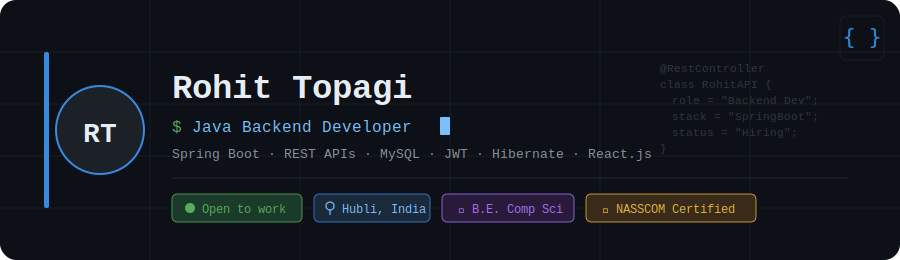

# Hi there, I'm Rohit Topagi 👋

  
  
  

---

### 👨‍💻 About Me

I'm a **Java Backend Developer** from Hubli, Karnataka, India 🇮🇳, passionate about building scalable, production-grade backend systems.

- 🔭 Currently building projects with **Spring Boot**, **React.js**, and **MySQL**
- 🌱 Strengthening my skills in **System Design**, **DSA**, and **Cloud technologies**
- 💼 Former **Cloud Application Developer Intern** at **Rooman Technologies Pvt. Ltd**
- 🎓 B.E. in Computer Science — *Smt. Kamala & Sri Venkappa M. Agadi College of Engineering* (CGPA: 7.87)
- ⚡ Fun fact: I started with a Diploma before diving into engineering — I love learning the fundamentals!

---

### 🛠️ Tech Stack

**Languages**

**Backend**

**Frontend**

**Database & Tools**

---

### 🚀 Projects

> 🔨 *All projects below are currently under active development — stay tuned for updates!*

---

#### 🛒 Shoposphere — Full Stack E-Commerce Application
`Spring Boot` `React.js` `MySQL` `JWT`

A full-stack e-commerce platform with 15+ RESTful APIs covering product management, cart, and order workflows.

- 🔐 JWT-based authentication with role-based access control (Admin / User)
- 🗃️ JPA/Hibernate ORM with `OneToMany` & `ManyToMany` relationships
- 🔒 BCrypt password encryption & global exception handling
- 🌐 Full React.js frontend consuming backend APIs

> 🔨 *Work in Progress — actively being built*

---

#### 📚 Library Management System
`Spring Boot` `MySQL` `REST API` `Postman`

A backend system for managing book inventory, member registration, and issue/return tracking.

- 📖 RESTful APIs for complete library operations
- 🗂️ Normalized JPA/Hibernate schema design
- ⚠️ Custom exception handling for edge cases
- ✅ All endpoints validated via Postman

> 🔨 *Work in Progress — actively being built*

---

#### 🌦️ Weather App
`React.js` `OpenWeatherMap API` `HTML5` `CSS3`

A responsive weather application delivering real-time weather data for any city in the world.

- 🌡️ Displays temperature, humidity, and wind speed
- 🔍 City-based search with dynamic UI rendering
- ⚛️ Built using React Hooks and component-based architecture
- 📱 Fully responsive design

> 🔨 *Work in Progress — actively being built*

---

### 💼 Experience

**Cloud Application Developer Intern** — *Rooman Technologies Pvt. Ltd*
`Sep 2024 – Feb 2025`

- Developed and enhanced modules for cloud-based applications using Java
- Contributed to API testing and deployment workflows
- Authored technical documentation and collaborated in an Agile environment

---

### 🎓 Education

| Degree | Institution | Year | Score |
|--------|-------------|------|-------|
| B.E. in Computer Science | Smt. Kamala & Sri Venkappa M. Agadi College of Engineering | Feb 2023 – May 2025 | CGPA: 7.87 |
| Diploma in Computer Science Engineering | Government Polytechnic Hubballi | Dec 2019 – Sep 2022 | 76% |

---

### 📜 Certifications

- 🏅 **Cloud Application Developer** — IT-ITeS Sector Skill Council (NASSCOM), NCVET Recognised
- 🐍 **Python Essentials** — Cisco Networking Academy

---

### 📊 GitHub Stats

  
  

---

### 📫 Let's Connect!

I'm actively looking for **Backend Java Developer** opportunities. If you're hiring or want to collaborate, feel free to reach out!

📧 rohittopagi982@gmail.com
📍 Hubli, Karnataka, India

---

  

